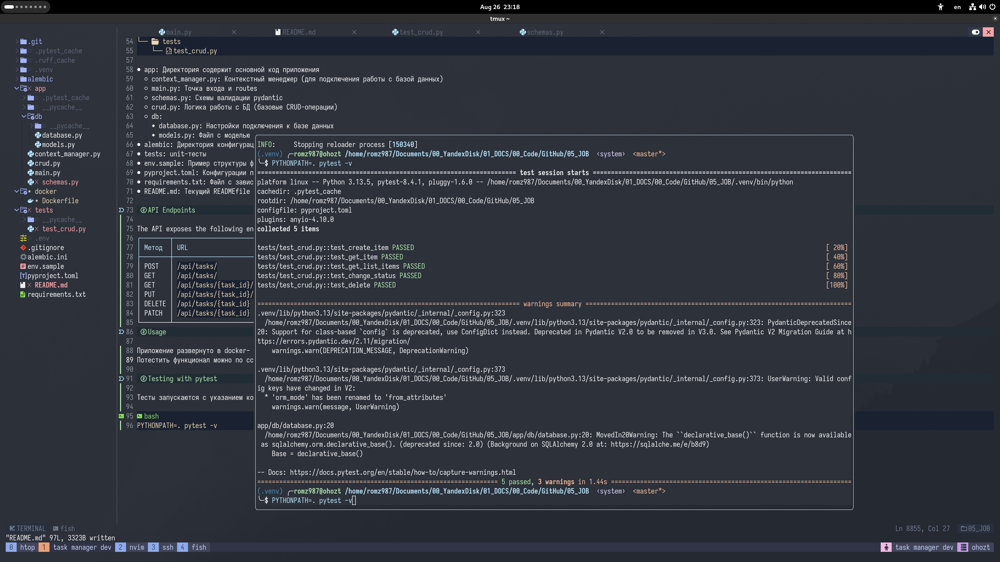

# Task Manager

Менеджер задач (Task Manager) - простое приложение, написанное в качестве тестового задания на вакансию.

Стек:

- FastAPI
- SQLAlchemy
- PostgreSQL
- Pytest
- Docker

Приложение развернуто в Docker-контейнере.\
Автогенерируемая документация: [Swagger UI](http://194.190.152.45:5006/docs)

## Table of Contents

- [Features](#Features)
- [Project Structure](#Project-Structure)
- [Usage](#Usage)
- [API Endpoints](#API-Endpoints)
- [Testing with pytest](#Testing-with-pytest)

## Features

- Базовые CRUD-операции
- Отдельная операция для обновления статуса задачи
- Простая структура проекта
- Swagger UI

## Project Structure

```
task-manager
.
├──   alembic
│   ├──  env.py
│   ├──   README
│   ├──  script.py.mako
│   └──   versions
├── alembic.ini
├──   app
│   ├──  context_manager.py
│   ├──  crud.py
│   ├──   db
│   │   ├──  database.py
│   │   └──  models.py
│   ├──  main.py
│   └──  schemas.py
├──  env.sample
├──   pyproject.toml
├──   README.md
├──  requirements.txt
└──   tests
    └──  test_crud.py
```

- app: Директория содержит основной код приложения
  - context_manager.py: Контекстный менеджер (для подключения работы с базой данных)
  - main.py: Точка входа и маршруты (routes)
  - schemas.py: Схемы валидации Pydantic
  - crud.py: Логика работы с БД (базовые CRUD-операции)
  - db:
    - database.py: Настройки подключения к базе данных
    - models.py: Файл с моделью тудушки
- alembic: Директория конфигурации Alembic и файлы миграции
- tests: модульные тесты
- env.sample: Пример структуры файла .env
- pyproject.toml: Конфигурации проекта
- requirements.txt: Файл с зависимостями
- README.md: Текущий README

## API Endpoints

The API exposes the following endpoints:

| Метод | URL | Описание |
|-------|-----|----------|
| POST | `/api/tasks/` | Добавить новую задачу |
| GET | `/api/tasks/` | Получить список задач |
| GET | `/api/tasks/{task_id}` | Получить задачу по id |
| PUT | `/api/tasks/{task_id}` | Обновить данные задачи по id |
| DELETE| `/api/tasks/{task_id}` | Удалить задачу по id |
| PATCH | `/api/tasks/{task_id}` | Обновить статус задачи по id |

## Usage

Приложение развернуто в docker- контейнере.
Потестить функционал можно по ссылке http://194.190.152.45:5006/

## Testing with pytest

Тесты запускаются с указанием корня проекта:

```bash
PYTHONPATH=. pytest -v
```


